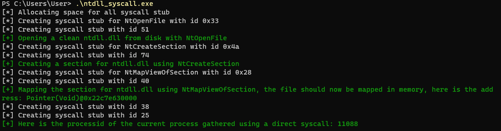

# Crystal_IndirectSyscall
PoC project made for fun to implement indirect syscall in Crystal.

- Not optimised
- Not made for production
- Coding style is horrible
- May crash
- May not work

## Screenshot

## References
- https://github.com/crystal-lang/crystal/blob/b5317ace12d11f788f922a8884202dcb3b0de84b/src/crystal/system/win32/fiber.cr
- https://crystal-lang.org/api/1.7.2/
- Crystal community Discord
- https://hfiref0x.github.io/NT10_syscalls.html
- https://github.com/HavocFramework/Havoc -> has heavily inspired this code
- https://blog.sektor7.net/#!res/2021/halosgate.md
- https://alice.climent-pommeret.red/
- https://github.com/reactos/reactos
- Microsoft doc
- Pinvoke.net
- Ntinternals.net
- https://www.ired.team/

